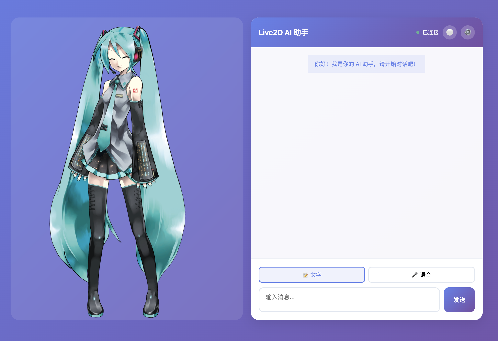

# Live2D AI 助手

一个集成的 Live2D 看板娘 AI 助手，支持实时语音交互。



## 功能特性

- **Live2D 看板娘**: Hiyori / 芊芊 / 初音未来 三个可选模型，动作表情丰富
- **Realtime 实时语音对话**: 按住说话，松开即回复，真正端到端实时交互
- **传统语音回环**: 音频 → VAD → ASR → LLM → TTS → 音频（支持火山引擎 V3 TTS）
- **文本对话**: 输入文本，AI 回复可切换语音播报
- **OpenClaw Agent 接入**: 支持接入 OpenClaw 桌面 AI Agent（截图感知 + 操作控制）

## 快速开始

### 1. 配置环境

```bash
cp .env.example .env
```

`.env` 关键配置项：

```bash
# LLM（必需）
LLM_PROVIDER=openai          # 或 deepseek
LLM_API_KEY=your-api-key
LLM_BASE_URL=https://api.openai.com/v1
LLM_MODEL=gpt-4o-mini

# Realtime 语音（推荐火山引擎，延迟最低）
REALTIME_TTS_PROVIDER=volc
VOLC_TTS_APP_ID=your-app-id
VOLC_TTS_ACCESS_TOKEN=your-access-token
VOLC_TTS_RESOURCE_ID=volc.service_type.10029
VOLC_TTS_WS_URL=wss://openspeech.bytedance.com/api/v3/tts/bidirection
VOLC_TTS_VOICE_TYPE=zh_female_cancan_mars_bigtts

# OpenClaw Agent（可选）
OPENCLAW_ENABLED=true
OPENCLAW_BASE_URL=http://127.0.0.1:18789
OPENCLAW_AGENT_NAME=Live2D
```

> 详细配置说明见 [INSTALL.md](INSTALL.md)。

### 2. 安装依赖

```bash
pip install -r requirements.txt
```

### 3. 启动服务

```bash
python start.py
```

### 4. 访问应用

打开浏览器访问：http://localhost:8000

## Realtime 实时语音对话

Realtime 模式通过 WebSocket 连接实现真正的端到端实时对话，延迟更低、交互更自然。

### 火山引擎 Realtime TTS 接入

火山引擎提供最低延迟的 TTS 体验（V3 双向流式接口），按以下步骤获取凭证：

1. 登录 [火山引擎控制台](https://console.volcengine.com)
2. 找到「语音合成」→ 「V3 双向流式 API」
3. 创建应用，获取 `App ID`、`Access Token`、`Resource ID`
4. 填写上方 `.env` 配置

### 交互方式

1. **Realtime 模式**: 在设置中选择 Realtime 输入模式，按住麦克风按钮说话，松开后 AI 实时回复，全程语音交互
2. **传统语音模式**: 按住录音，松开后提交，完整回环后播放语音回复
3. **文本模式**: 直接在输入框输入文本，发送后 AI 回复（可选择语音播报）

## OpenClaw Agent 接入

OpenClaw 是一款桌面 AI Agent，支持屏幕截图感知和操作系统级操作控制。

### 接入步骤

1. 下载安装 [OpenClaw](https://github.com/your-openclaw-repo)（Windows/macOS）
2. 启动 OpenClaw 并保持后台运行（默认端口 `18789`）
3. 在本应用设置中开启 OpenClaw 并填入地址

```bash
OPENCLAW_ENABLED=true
OPENCLAW_BASE_URL=http://127.0.0.1:18789
OPENCLAW_AGENT_NAME=Live2D
```

开启后，AI 可以：
- 感知当前屏幕内容（截图发给 AI 分析）
- 根据用户指令执行桌面操作（点击、输入等）
- 回答"屏幕上显示的是什么"等问题

## 项目结构

```
live2d-openclaw-assistant/
├── frontend/
│   ├── static/
│   │   ├── css/
│   │   ├── js/              # app.js, live2d-controller.js, realtime-voice-controller.js
│   │   └── live2d/          # Live2D 模型文件
│   └── templates/
├── backend/
│   ├── main.py              # FastAPI 主程序
│   ├── api/                 # API 路由
│   │   ├── websocket.py     # Realtime WebSocket 端点
│   │   └── settings.py      # 设置管理
│   └── services/
│       ├── llm_service.py   # LLM 调用
│       ├── tts_service.py   # TTS 合成
│       └── realtime_volc.py # 火山引擎 Realtime TTS
├── docs/
│   └── images/              # 界面截图
├── requirements.txt
├── .env.example
└── start.py
```

## 详细文档

- [INSTALL.md](INSTALL.md) — 完整配置说明、故障排除
- [docs/superpowers/specs/](docs/superpowers/specs/) — 架构设计文档

## 技术栈

| 模块 | 技术 |
|------|------|
| 前端 | HTML5, CSS3, JavaScript, Live2D Cubism SDK |
| 后端 | Python (FastAPI) |
| Realtime 语音 | 火山引擎 V3 TTS (WebSocket) |
| ASR | faster-whisper |
| LLM | OpenAI 兼容接口 |
| TTS | edge-tts / 火山引擎 |
| VAD | 能量检测 |
| Agent | OpenClaw |

## 许可证

MIT License
