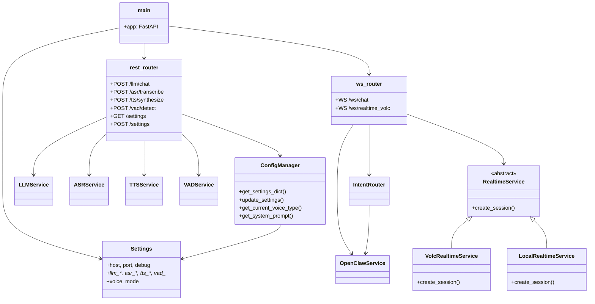
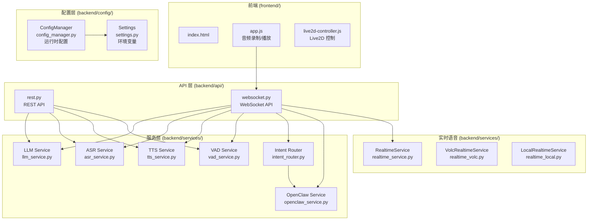
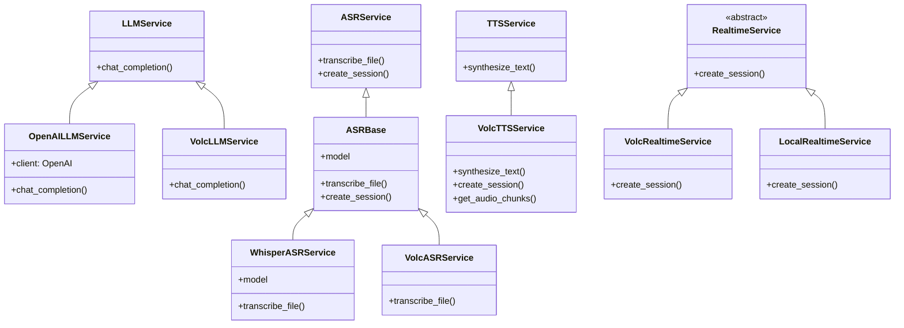
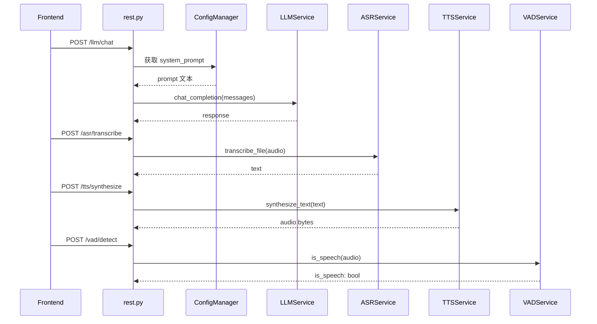
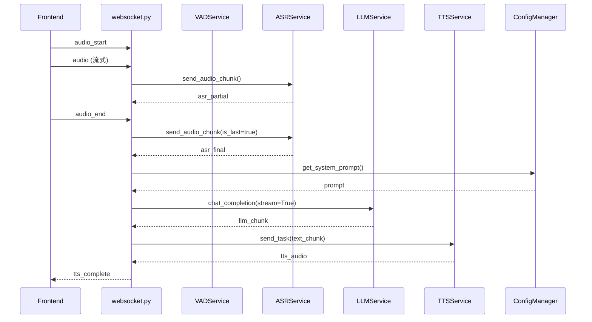
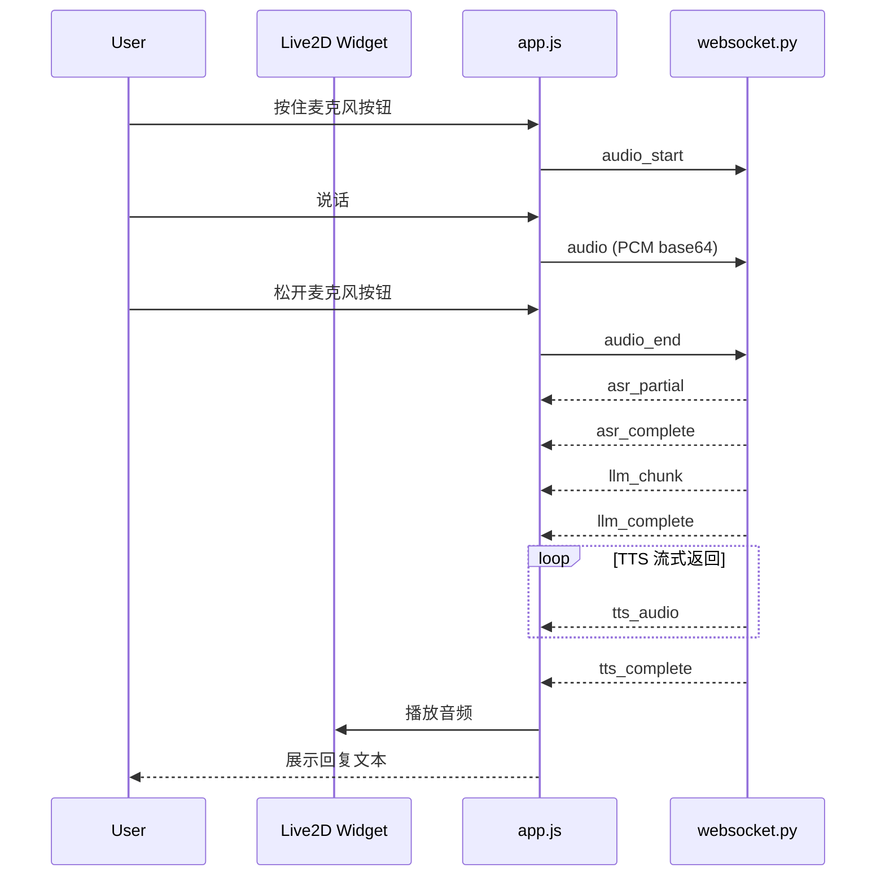

# 程序架构说明

## 目录

1. [系统概览](#1-系统概览)
2. [项目结构](#2-项目结构)
3. [技术架构图](#3-技术架构图)
4. [后端服务模块](#4-后端服务模块)
5. [模块依赖关系](#5-模块依赖关系)
6. [前端模块](#6-前端模块)

---

## 1. 系统概览

### 1.1 项目定位

Live2D AI 助手是一个集成了 Live2D 看板娘的智能对话系统，支持**文本对话**和**语音对话**两种交互模式。

### 1.2 技术栈

| 层级 | 技术 |
|------|------|
| 前端 | HTML5, CSS3, JavaScript, Live2D Widget |
| 后端 | Python FastAPI |
| ASR | faster-whisper（本地）、Volc ASR（云端） |
| LLM | OpenAI 兼容接口（OpenAI、DeepSeek、阿里等） |
| TTS | edge-tts（本地）、Volc TTS（云端） |
| VAD | Silero VAD（能量检测） |

### 1.3 两种语音模式

本项目支持两种不同的语音交互模式：

| 模式 | 说明 | 特点 |
|------|------|------|
| **pipeline（语音回环）** | VAD → ASR → LLM → TTS 分阶段处理 | 支持断句、通用 ASR 模型 |
| **realtime（实时语音）** | WebSocket 流式端到端对话 | 低延迟、自带 ASR/TTS |

配置通过环境变量 `VOICE_MODE` 选择：

```python
VOICE_MODE=pipeline     # 默认，分阶段语音回环
VOICE_MODE=realtime_volc  # 火山端到端实时语音
VOICE_MODE=realtime_local # 本地模型（预留）
```

---

## 2. 项目结构



---

## 3. 技术架构图

### 3.1 系统分层架构



### 3.2 服务模块职责一览

| 模块 | 文件 | 职责 |
|------|------|------|
| **LLM Service** | `llm_service.py` | LLM 调用封装，支持 OpenAI 兼容接口 |
| **ASR Service** | `asr_service.py` | 语音识别服务抽象，根据配置选择 faster-whisper 或 Volc ASR |
| **TTS Service** | `tts_service.py` | 语音合成服务抽象，根据配置选择 edge-tts 或 Volc TTS |
| **VAD Service** | `vad_service.py` | 语音活动检测，使用 Silero VAD 模型 |
| **Intent Router** | `intent_router.py` | 意图识别，决定走 OpenClaw 还是普通 LLM |
| **OpenClaw Service** | `openclaw_service.py` | OpenClaw webhook 调用 |
| **ConfigManager** | `config_manager.py` | 运行时配置管理（性格、语速、TTS 参数等） |

---

## 4. 后端服务模块

### 4.1 目录结构

```
backend/
├── main.py                 # FastAPI 应用入口
├── api/
│   ├── rest.py            # REST API 路由
│   └── websocket.py       # WebSocket 路由
├── config/
│   ├── settings.py        # 环境变量配置
│   └── config_manager.py  # 运行时配置管理
└── services/
    ├── llm_service.py     # LLM 服务抽象
    ├── llm_openai.py      # OpenAI LLM 实现
    ├── llm_volc.py        # 火山 LLM 实现
    ├── asr_service.py      # ASR 服务抽象
    ├── asr_base.py        # ASR 基类
    ├── asr_whisper.py     # faster-whisper 实现
    ├── asr_volc.py        # 火山 ASR 实现
    ├── tts_service.py      # TTS 服务抽象
    ├── tts_base.py        # TTS 基类
    ├── tts_volc.py        # 火山 TTS 实现
    ├── vad_service.py     # VAD 服务
    ├── intent_router.py   # 意图路由
    ├── openclaw_service.py # OpenClaw 调用
    ├── realtime_service.py  # 实时语音工厂
    ├── realtime_base.py    # 实时语音抽象基类
    ├── realtime_volc.py    # 火山实时语音实现
    └── realtime_local.py   # 本地实时语音实现
```

### 4.2 服务实现继承关系



---

## 5. 模块依赖关系

### 5.1 REST API 请求处理链



### 5.2 WebSocket 语音回环处理链



---

## 6. 前端模块

### 6.1 前端目录结构

```
frontend/
├── templates/
│   └── index.html          # 主页面
└── static/
    ├── css/                # 样式文件
    └── js/
        ├── app.js          # 主应用逻辑
        ├── chat.js         # 聊天逻辑
        ├── audio-recorder.js # 音频录制
        ├── live2d-controller.js # Live2D 控制
        └── live2d-wrapper.js    # Live2D 封装
```

### 6.2 前端与后端交互



### 6.3 前端核心功能

| 文件 | 职责 |
|------|------|
| `app.js` | WebSocket 连接管理、消息收发、音频流处理 |
| `chat.js` | 对话历史管理、UI 更新 |
| `audio-recorder.js` | 麦克风音频采集、VAD 前端检测 |
| `live2d-controller.js` | Live2D 动作、表情控制 |
| `live2d-wrapper.js` | Live2D SDK 封装 |

---

## 附录：关键配置项

| 环境变量 | 说明 | 默认值 |
|----------|------|--------|
| `VOICE_MODE` | 语音模式：pipeline / realtime_volc / realtime_local | `pipeline` |
| `LLM_API_KEY` | LLM API 密钥 | - |
| `LLM_MODEL` | LLM 模型 | `qwen-max` |
| `ASR_PROVIDER` | ASR 提供商：whisper / volc | `whisper` |
| `TTS_PROVIDER` | TTS 提供商：volc / edge | `volc` |
| `VOLC_TTS_VOICE_TYPE` | TTS 音色 ID | `zh_female_cancan_mars_bigtts` |
