# 程序运行流程

## 目录

1. [启动流程](#1-启动流程)
2. [文本对话流程](#2-文本对话流程)
3. [语音对话流程（语音回环模式）](#3-语音对话流程语音回环模式)
4. [实时语音流程（WebSocket）](#4-实时语音流程websocket)
5. [OpenClaw 集成流程](#5-openclaw-集成流程)

---

## 1. 启动流程

### 1.1 启动序列

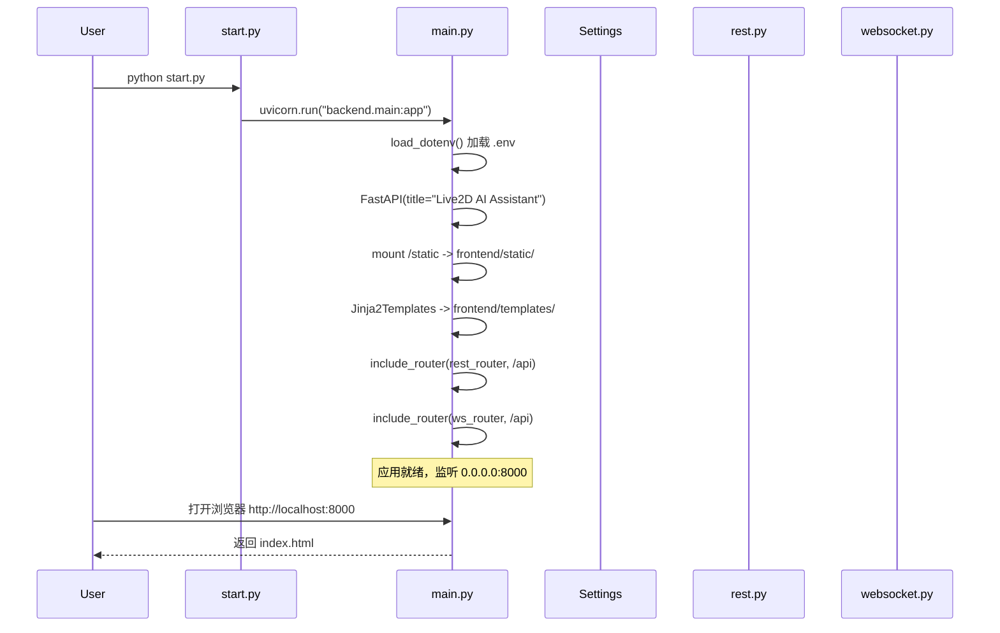

### 1.2 服务初始化顺序

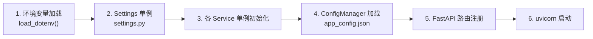

---

## 2. 文本对话流程

### 2.1 序列图

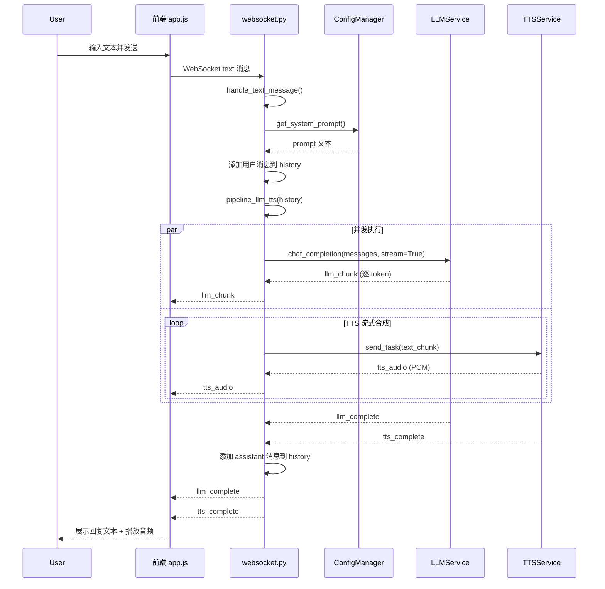

### 2.2 LLM → TTS 流水线细节

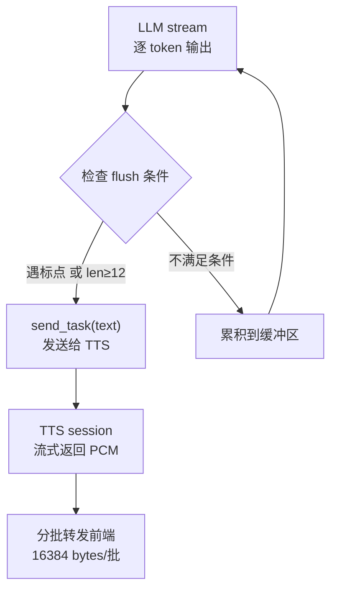

---

## 3. 语音对话流程（语音回环模式）

### 3.1 完整语音回环概览

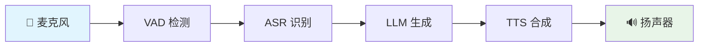

### 3.2 音频采集到播放完整序列

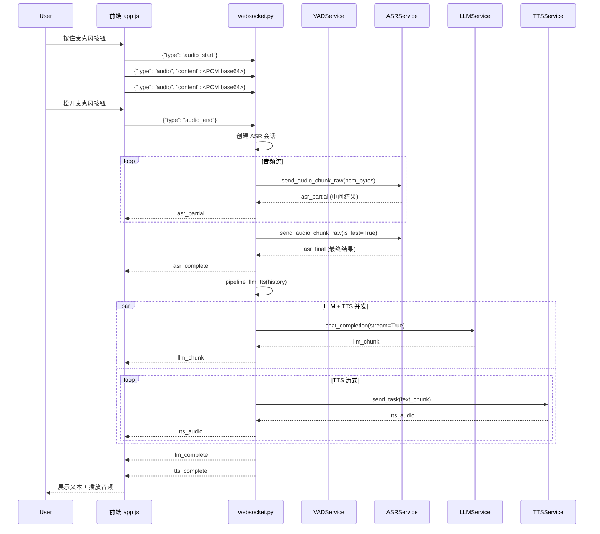

### 3.3 VAD 缓冲处理流程

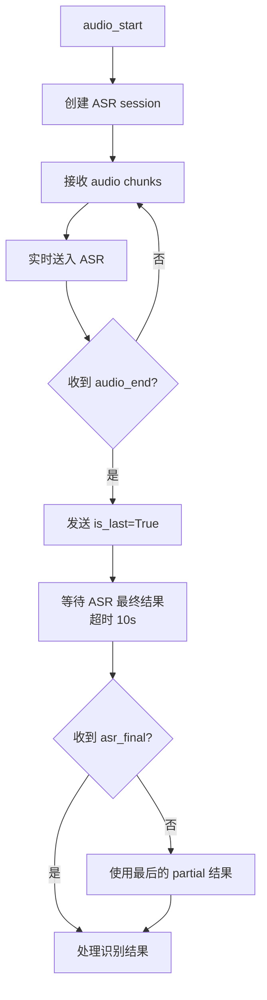

---

## 4. 实时语音流程（WebSocket）

### 4.1 端到端实时语音概览

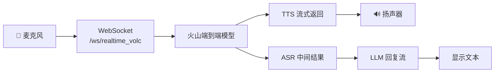

### 4.2 WebSocket 实时语音会话序列

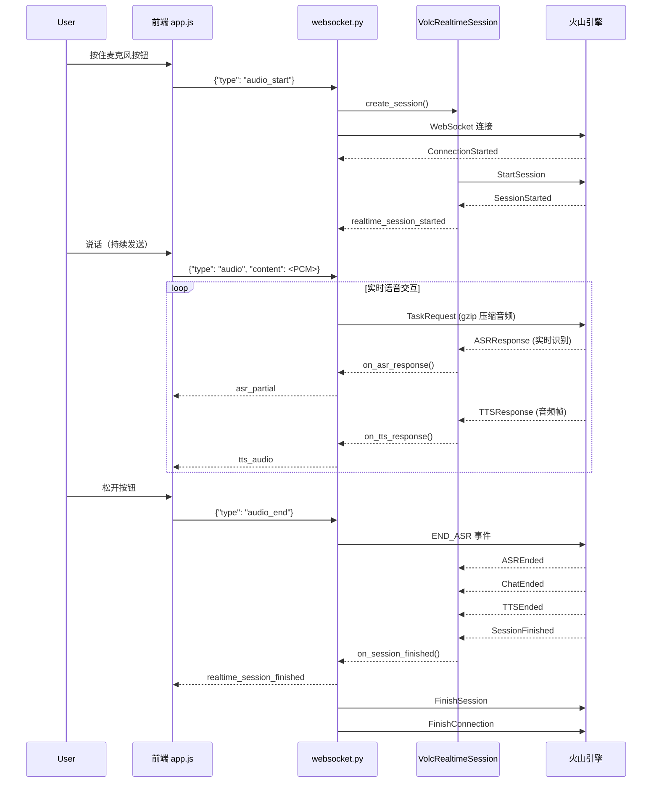

### 4.3 实时语音服务端事件处理

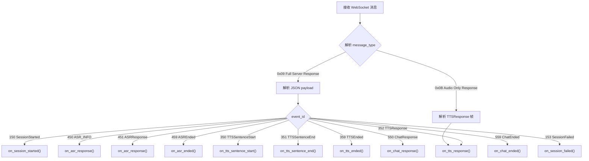

---

## 5. OpenClaw 集成流程

### 5.1 意图路由决策

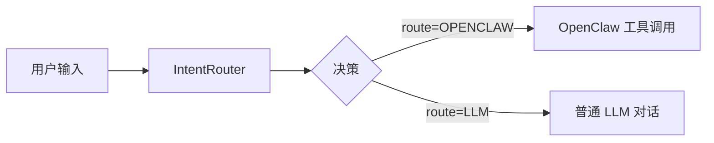

### 5.2 OpenClaw 处理序列

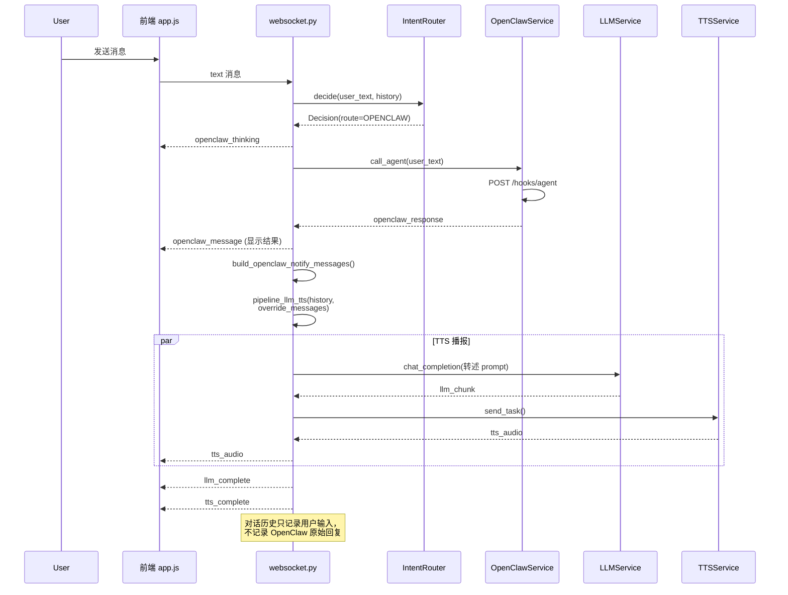

---

## 附录：消息类型参考

### WebSocket 客户端消息

| type | 说明 |
|------|------|
| `text` | 文本消息 |
| `audio_start` | 开始发送音频流 |
| `audio` | 音频数据块（base64 PCM） |
| `audio_end` | 音频流结束 |

### WebSocket 服务端消息

| type | 说明 |
|------|------|
| `status` | 状态通知 |
| `asr_partial` | ASR 中间结果 |
| `asr_complete` | ASR 最终结果 |
| `llm_chunk` | LLM 流式输出 |
| `llm_complete` | LLM 输出完成 |
| `llm_thinking` | LLM 思考中 |
| `tts_audio` | TTS 音频数据 |
| `tts_complete` | TTS 播放完成 |
| `tts_sentence_start` | TTS 句子开始 |
| `tts_sentence_end` | TTS 句子结束 |
| `openclaw_thinking` | OpenClaw 处理中 |
| `openclaw_message` | OpenClaw 返回结果 |
| `realtime_session_started` | 实时语音会话启动 |
| `realtime_session_finished` | 实时语音会话结束 |
| `error` | 错误信息 |
